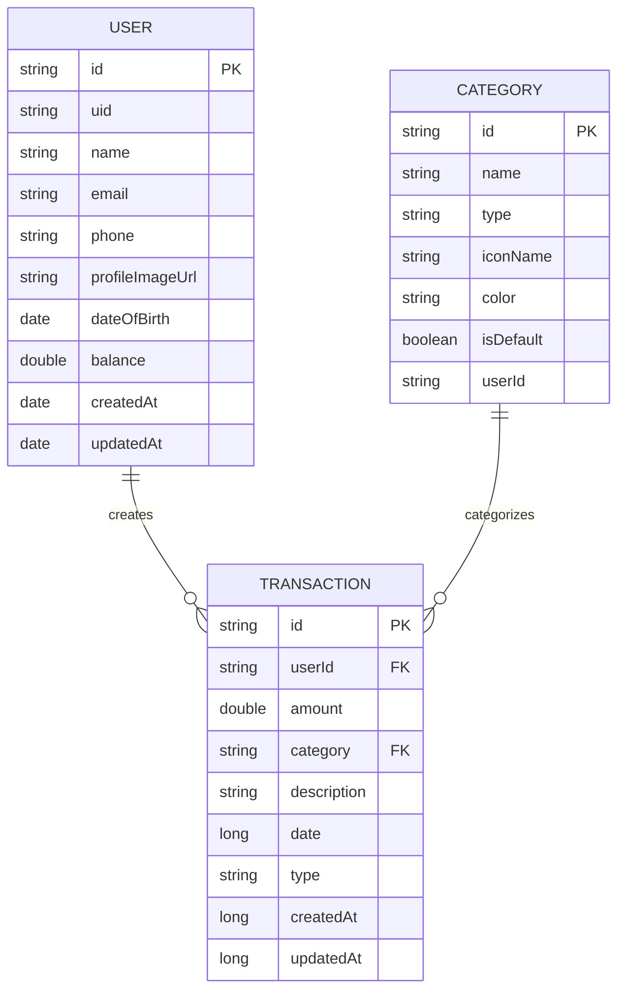

# Sơ đồ Cơ sở dữ liệu Quản lý Tài chính Cá nhân

Dự án sử dụng Firebase Firestore làm cơ sở dữ liệu NoSQL chính và Firebase Realtime Database làm cơ sở dữ liệu dự phòng/đồng bộ. Dưới đây là sơ đồ cấu trúc dữ liệu:



## Mô tả các Collection

### 1. Users Collection

- **id**: Định danh duy nhất của người dùng (từ Firebase Authentication)
- **uid**: Định danh người dùng (đồng nhất với id)
- **name**: Tên người dùng
- **email**: Email đăng nhập
- **phone**: Số điện thoại
- **profileImageUrl**: URL ảnh hồ sơ
- **dateOfBirth**: Ngày sinh
- **balance**: Số dư tài khoản
- **createdAt**: Thời điểm tạo tài khoản
- **updatedAt**: Thời điểm cập nhật thông tin

### 2. Categories Collection

- **id**: Định danh duy nhất của danh mục
- **name**: Tên danh mục
- **type**: Loại danh mục ("income" - thu nhập hoặc "expense" - chi tiêu)
- **iconName**: Tên biểu tượng của danh mục
- **color**: Mã màu cho danh mục
- **isDefault**: Cờ đánh dấu danh mục mặc định
- **userId**: ID người dùng sở hữu danh mục (null/system cho danh mục mặc định)

### 3. Transactions Collection

- **id**: Định danh duy nhất của giao dịch
- **userId**: ID người dùng thực hiện giao dịch (tham chiếu đến Users)
- **amount**: Số tiền giao dịch
- **category**: Danh mục giao dịch (tham chiếu đến Categories)
- **description**: Mô tả chi tiết giao dịch
- **date**: Thời gian thực hiện giao dịch (timestamp)
- **type**: Loại giao dịch ("income" - thu nhập hoặc "expense" - chi tiêu)
- **createdAt**: Thời điểm tạo giao dịch (timestamp)
- **updatedAt**: Thời điểm cập nhật giao dịch (timestamp)

## Các mối quan hệ

1. Một User có thể có nhiều Transaction (1-n)
2. Một Category có thể được sử dụng trong nhiều Transaction (1-n)
3. Mỗi User có thể sở hữu nhiều Category (1-n)

## Lưu ý về Firebase Firestore

Firestore là cơ sở dữ liệu NoSQL, nên không có khái niệm về khóa ngoại (foreign key) như trong cơ sở dữ liệu quan hệ. Thay vào đó, các tham chiếu được thực hiện bằng cách lưu trữ ID của document trong một collection khác.

Việc quản lý tính toàn vẹn dữ liệu phải được thực hiện ở tầng ứng dụng thông qua code Java trong các lớp utility như `DataUtils`, `UserUtils`, `CategoryUtils`, và `TransactionUtils`.

## Firebase Realtime Database

Dự án cũng sử dụng Firebase Realtime Database làm cơ sở dữ liệu dự phòng/đồng bộ, chủ yếu cho các thông tin người dùng. Cấu trúc dữ liệu tương tự như Firestore.

### Cấu trúc Realtime Database:

```
/users
  /userId
    id: "userId"
    uid: "userId"
    name: "Tên người dùng"
    email: "email@example.com"
    phone: "0123456789"
    balance: 0.0
    createdAt: timestamp
    updatedAt: timestamp
    dateOfBirth: timestamp (tùy chọn)
    metadata: {
      lastLogin: timestamp
      device: "Android"
      appVersion: "1.0"
    }
```

## Rules và Quyền Truy Cập

### Firestore Rules

```
rules_version = '2';
service cloud.firestore {
  match /databases/{database}/documents {
    match /users/{userId} {
      allow read, write: if request.auth != null && request.auth.uid == userId;
    }
    match /users/{userId}/transactions/{transactionId} {
      allow read, write: if request.auth != null && request.auth.uid == userId;
    }
    match /categories/{categoryId} {
      allow read: if request.auth != null;
      allow write: if request.auth != null && (
        resource == null || 
        resource.data.userId == null || 
        resource.data.userId == "system" || 
        resource.data.userId == request.auth.uid
      );
    }
  }
}
```

### Realtime Database Rules

```
{
  "rules": {
    ".read": "auth != null",
    ".write": "auth != null",
    "users": {
      "$uid": {
        ".read": "auth != null && auth.uid == $uid",
        ".write": "auth != null && auth.uid == $uid"
      }
    }
  }
}
```

## Lưu Trữ Offline và Đồng Bộ Hóa

Ứng dụng hỗ trợ lưu trữ offline (cache) cho cả Firestore và Realtime Database. Dữ liệu sẽ được đồng bộ hóa khi có kết nối mạng. Để kích hoạt tính năng này:

```java
// Trong Application class (onCreate)
FirebaseDatabase.getInstance().setPersistenceEnabled(true);
```

## Xử Lý Lỗi Quyền Truy Cập

Đối với các trường hợp lỗi quyền truy cập (PERMISSION_DENIED), ứng dụng được thiết kế để vẫn tiếp tục vận hành bằng cách:

1. Hiển thị thông báo phù hợp cho người dùng
2. Sử dụng dữ liệu trong bộ nhớ cache nếu có
3. Tiếp tục với chức năng chính dù có lỗi với cơ sở dữ liệu phụ 