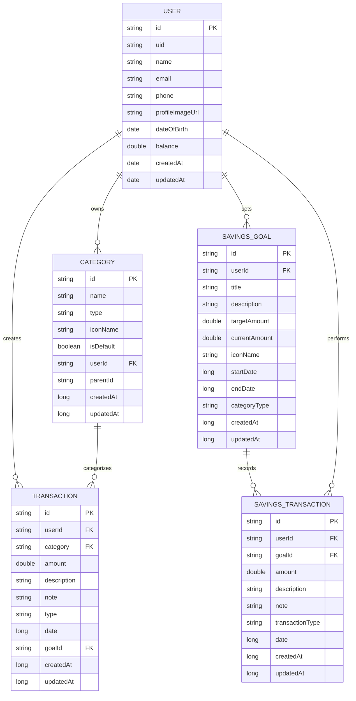
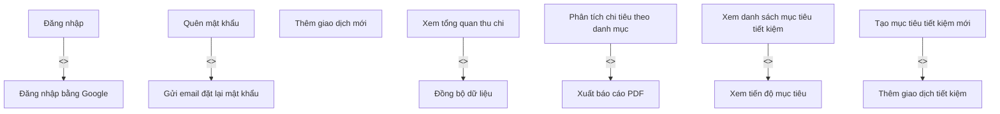

# Sơ đồ Cơ sở dữ liệu Quản lý Tài chính Cá nhân

Dự án sử dụng Firebase Firestore làm cơ sở dữ liệu NoSQL chính và Firebase Realtime Database làm cơ sở dữ liệu dự phòng/đồng bộ. Dưới đây là sơ đồ cấu trúc dữ liệu:



## Mô tả các Collection

### 1. Users Collection

- **id**: Định danh duy nhất của người dùng (từ Firebase Authentication)
- **uid**: Định danh người dùng (đồng nhất với id)
- **name**: Tên người dùng
- **email**: Email đăng nhập
- **phone**: Số điện thoại
- **profileImageUrl**: URL ảnh hồ sơ
- **dateOfBirth**: Ngày sinh
- **balance**: Số dư tài khoản
- **createdAt**: Thời điểm tạo tài khoản
- **updatedAt**: Thời điểm cập nhật thông tin

### 2. Categories Collection

- **id**: Định danh duy nhất của danh mục
- **name**: Tên danh mục
- **type**: Loại danh mục ("income" - thu nhập hoặc "expense" - chi tiêu)
- **iconName**: Tên biểu tượng của danh mục
- **isDefault**: Cờ đánh dấu danh mục mặc định
- **userId**: ID người dùng sở hữu danh mục (null/system cho danh mục mặc định)
- **parentId**: ID của danh mục cha (null nếu là danh mục gốc)
- **createdAt**: Thời điểm tạo danh mục
- **updatedAt**: Thời điểm cập nhật danh mục

### 3. Transactions Collection

- **id**: Định danh duy nhất của giao dịch
- **userId**: ID người dùng thực hiện giao dịch (tham chiếu đến Users)
- **category**: ID của danh mục giao dịch (tham chiếu đến Categories)
- **amount**: Số tiền giao dịch
- **description**: Mô tả chi tiết giao dịch
- **note**: Ghi chú thêm cho giao dịch
- **type**: Loại giao dịch ("income" - thu nhập hoặc "expense" - chi tiêu)
- **date**: Thời gian thực hiện giao dịch (timestamp)
- **goalId**: ID của mục tiêu tiết kiệm (nếu giao dịch liên quan đến mục tiêu)
- **createdAt**: Thời điểm tạo giao dịch (timestamp)
- **updatedAt**: Thời điểm cập nhật giao dịch (timestamp)

### 4. SavingsGoals Collection

- **id**: Định danh duy nhất của mục tiêu tiết kiệm
- **userId**: ID người dùng sở hữu mục tiêu (tham chiếu đến Users)
- **title**: Tiêu đề mục tiêu
- **description**: Mô tả chi tiết mục tiêu
- **targetAmount**: Số tiền mục tiêu cần đạt được
- **currentAmount**: Số tiền hiện tại đã tiết kiệm
- **iconName**: Tên biểu tượng của mục tiêu
- **startDate**: Ngày bắt đầu mục tiêu (timestamp)
- **endDate**: Ngày kết thúc mục tiêu (timestamp)
- **categoryType**: Loại danh mục mục tiêu (travel, house, car, wedding, v.v.)
- **createdAt**: Thời điểm tạo mục tiêu (timestamp)
- **updatedAt**: Thời điểm cập nhật mục tiêu (timestamp)

### 5. SavingsTransactions Collection

- **id**: Định danh duy nhất của giao dịch tiết kiệm
- **userId**: ID người dùng thực hiện giao dịch (tham chiếu đến Users)
- **goalId**: ID của mục tiêu tiết kiệm (tham chiếu đến SavingsGoals)
- **amount**: Số tiền giao dịch
- **description**: Mô tả chi tiết giao dịch
- **note**: Ghi chú thêm cho giao dịch
- **transactionType**: Loại giao dịch ("deposit" - gửi tiền hoặc "withdraw" - rút tiền)
- **date**: Thời gian thực hiện giao dịch (timestamp)
- **createdAt**: Thời điểm tạo giao dịch (timestamp)
- **updatedAt**: Thời điểm cập nhật giao dịch (timestamp)

## Các mối quan hệ

1. Một User có thể có nhiều Transaction (1-n)
2. Một User có thể sở hữu nhiều Category (1-n)
3. Một Category có thể được sử dụng trong nhiều Transaction (1-n)
4. Một User có thể có nhiều SavingsGoal (1-n)
5. Một SavingsGoal có thể có nhiều SavingsTransaction (1-n)
6. Một User thực hiện nhiều SavingsTransaction (1-n)

## Lưu ý về Firebase Firestore

Firestore là cơ sở dữ liệu NoSQL, nên không có khái niệm về khóa ngoại (foreign key) như trong cơ sở dữ liệu quan hệ. Thay vào đó, các tham chiếu được thực hiện bằng cách lưu trữ ID của document trong một collection khác.

Việc quản lý tính toàn vẹn dữ liệu phải được thực hiện ở tầng ứng dụng thông qua code Java trong các lớp utility như `DataUtils`, `UserUtils`, `CategoryUtils`, `TransactionUtils`, `SavingsGoalUtils`, và `SavingsTransactionUtils`.

## Firebase Realtime Database

Dự án cũng sử dụng Firebase Realtime Database làm cơ sở dữ liệu dự phòng/đồng bộ, chủ yếu cho các thông tin người dùng. Cấu trúc dữ liệu tương tự như Firestore.

### Cấu trúc Realtime Database:

```
/users
  /userId
    id: "userId"
    uid: "userId"
    name: "Tên người dùng"
    email: "email@example.com"
    phone: "0123456789"
    balance: 0.0
    createdAt: timestamp
    updatedAt: timestamp
    dateOfBirth: timestamp (tùy chọn)
    metadata: {
      lastLogin: timestamp
      device: "Android"
      appVersion: "1.0"
    }

/savings_goals
  /goalId
    id: "goalId"
    userId: "userId"
    title: "Tên mục tiêu"
    currentAmount: 0.0
    targetAmount: 5000000.0
    startDate: timestamp
    endDate: timestamp
    categoryType: "travel"
```

## Rules và Quyền Truy Cập

### Firestore Rules

```
rules_version = '2';
service cloud.firestore {
  match /databases/{database}/documents {
    match /users/{userId} {
      allow read, write: if request.auth != null && request.auth.uid == userId;
    }
    match /transactions/{transactionId} {
      allow read, write: if request.auth != null && resource.data.userId == request.auth.uid;
    }
    match /categories/{categoryId} {
      allow read: if request.auth != null;
      allow write: if request.auth != null && (
        resource == null || 
        resource.data.userId == null || 
        resource.data.userId == "system" || 
        resource.data.userId == request.auth.uid
      );
    }
    match /savings_goals/{goalId} {
      allow read, write: if request.auth != null && resource.data.userId == request.auth.uid;
    }
    match /savings_transactions/{transactionId} {
      allow read, write: if request.auth != null && resource.data.userId == request.auth.uid;
    }
  }
}
```

### Realtime Database Rules

```
{
  "rules": {
    ".read": "auth != null",
    ".write": "auth != null",
    "users": {
      "$uid": {
        ".read": "auth != null && auth.uid == $uid",
        ".write": "auth != null && auth.uid == $uid"
      }
    },
    "savings_goals": {
      "$goalId": {
        ".read": "auth != null && data.child('userId').val() == auth.uid",
        ".write": "auth != null && data.child('userId').val() == auth.uid"
      }
    }
  }
}
```

## Lưu Trữ Offline và Đồng Bộ Hóa

Ứng dụng hỗ trợ lưu trữ offline (cache) cho cả Firestore và Realtime Database. Dữ liệu sẽ được đồng bộ hóa khi có kết nối mạng. Để kích hoạt tính năng này:

```java
// Trong Application class (onCreate)
FirebaseDatabase.getInstance().setPersistenceEnabled(true);
FirebaseFirestore.getInstance().setFirestoreSettings(
    new FirebaseFirestoreSettings.Builder()
        .setPersistenceEnabled(true)
        .build());
``` 

# Sơ đồ Use Case - Ứng dụng Quản lý Tài chính Cá nhân

```mermaid
flowchart TB
    %% Định nghĩa người dùng
    User((Người dùng))
    
    subgraph "Quản lý tài khoản"
        UC1[Đăng ký tài khoản]
        UC2[Đăng nhập]
        UC3[Quên mật khẩu]
        UC4[Quản lý thông tin cá nhân]
        UC5[Thay đổi mật khẩu]
        UC6[Đăng xuất]
    end
    
    subgraph "Quản lý giao dịch"
        UC10[Xem danh sách giao dịch]
        UC11[Thêm giao dịch mới]
        UC12[Chỉnh sửa giao dịch]
        UC13[Xóa giao dịch]
        UC14[Lọc giao dịch]
        UC15[Tìm kiếm giao dịch]
    end
    
    subgraph "Quản lý danh mục"
        UC20[Xem danh sách danh mục]
        UC21[Thêm danh mục mới]
        UC22[Chỉnh sửa danh mục]
        UC23[Xóa danh mục]
    end
    
    subgraph "Phân tích tài chính"
        UC30[Xem tổng quan thu chi]
        UC31[Xem biểu đồ thu chi theo ngày]
        UC32[Xem biểu đồ thu chi theo tuần]
        UC33[Xem biểu đồ thu chi theo tháng]
        UC34[Phân tích chi tiêu theo danh mục]
    end
    
    subgraph "Quản lý mục tiêu tiết kiệm"
        UC40[Xem danh sách mục tiêu tiết kiệm]
        UC41[Tạo mục tiêu tiết kiệm mới]
        UC42[Thêm giao dịch tiết kiệm]
        UC43[Rút tiền từ mục tiêu tiết kiệm]
        UC44[Xem tiến độ mục tiêu]
        UC45[Chỉnh sửa mục tiêu tiết kiệm]
        UC46[Xóa mục tiêu tiết kiệm]
    end
    
    subgraph "Cài đặt ứng dụng"
        UC50[Thay đổi cài đặt chung]
        UC51[Cài đặt bảo mật]
        UC52[Cài đặt thông báo]
    end
    
    %% Kết nối người dùng với các use case
    User --> UC1
    User --> UC2
    User --> UC3
    User --> UC4
    User --> UC5
    User --> UC6
    
    User --> UC10
    User --> UC11
    User --> UC12
    User --> UC13
    User --> UC14
    User --> UC15
    
    User --> UC20
    User --> UC21
    User --> UC22
    User --> UC23
    
    User --> UC30
    User --> UC31
    User --> UC32
    User --> UC33
    User --> UC34
    
    User --> UC40
    User --> UC41
    User --> UC42
    User --> UC43
    User --> UC44
    User --> UC45
    User --> UC46
    
    User --> UC50
    User --> UC51
    User --> UC52 
```



## Mô tả chi tiết các Use Case

### Quản lý tài khoản
1. **Đăng ký tài khoản**: Người dùng tạo tài khoản mới bằng email và mật khẩu
2. **Đăng nhập**: Người dùng đăng nhập vào ứng dụng bằng email và mật khẩu
3. **Quên mật khẩu**: Người dùng đặt lại mật khẩu thông qua email
4. **Quản lý thông tin cá nhân**: Xem và cập nhật thông tin cá nhân (tên, ảnh hồ sơ, ngày sinh...)
5. **Thay đổi mật khẩu**: Người dùng thay đổi mật khẩu đăng nhập
6. **Đăng xuất**: Người dùng đăng xuất khỏi ứng dụng

### Quản lý giao dịch
1. **Xem danh sách giao dịch**: Hiển thị danh sách các giao dịch thu chi đã thực hiện
2. **Thêm giao dịch mới**: Thêm một giao dịch thu/chi mới vào hệ thống
3. **Chỉnh sửa giao dịch**: Sửa đổi thông tin giao dịch đã có
4. **Xóa giao dịch**: Xóa một giao dịch khỏi hệ thống
5. **Lọc giao dịch**: Lọc giao dịch theo loại (thu nhập/chi tiêu), thời gian, danh mục
6. **Tìm kiếm giao dịch**: Tìm kiếm giao dịch theo từ khóa

### Quản lý danh mục
1. **Xem danh sách danh mục**: Hiển thị tất cả danh mục thu chi đã tạo
2. **Thêm danh mục mới**: Thêm một danh mục thu/chi mới vào hệ thống
3. **Chỉnh sửa danh mục**: Sửa đổi thông tin danh mục đã có
4. **Xóa danh mục**: Xóa một danh mục khỏi hệ thống

### Phân tích tài chính
1. **Xem tổng quan thu chi**: Hiển thị tổng thu nhập, chi tiêu và số dư
2. **Xem biểu đồ thu chi theo ngày**: Hiển thị biểu đồ thu chi theo từng ngày
3. **Xem biểu đồ thu chi theo tuần**: Hiển thị biểu đồ thu chi theo tuần
4. **Xem biểu đồ thu chi theo tháng**: Hiển thị biểu đồ thu chi theo tháng
5. **Phân tích chi tiêu theo danh mục**: Hiển thị tỷ lệ chi tiêu theo từng danh mục

### Quản lý mục tiêu tiết kiệm
1. **Xem danh sách mục tiêu tiết kiệm**: Hiển thị tất cả các mục tiêu tiết kiệm
2. **Tạo mục tiêu tiết kiệm mới**: Thêm một mục tiêu tiết kiệm mới
3. **Thêm giao dịch tiết kiệm**: Gửi tiền vào mục tiêu tiết kiệm
4. **Rút tiền từ mục tiêu tiết kiệm**: Rút tiền ra từ mục tiêu tiết kiệm
5. **Xem tiến độ mục tiêu**: Xem tiến độ hoàn thành mục tiêu tiết kiệm
6. **Chỉnh sửa mục tiêu tiết kiệm**: Thay đổi thông tin mục tiêu tiết kiệm
7. **Xóa mục tiêu tiết kiệm**: Xóa một mục tiêu tiết kiệm khỏi hệ thống

### Cài đặt ứng dụng
1. **Thay đổi cài đặt chung**: Thay đổi các cài đặt chung của ứng dụng
2. **Cài đặt bảo mật**: Quản lý cài đặt bảo mật
3. **Cài đặt thông báo**: Quản lý cài đặt thông báo và nhắc nhở

## Quan hệ mở rộng và bao gồm



## Các ràng buộc

1. Người dùng phải đăng nhập để sử dụng hầu hết các chức năng
2. Dữ liệu được đồng bộ khi có kết nối internet
3. Ứng dụng hỗ trợ lưu trữ offline khi không có kết nối
4. Một số chức năng như xuất báo cáo đang được phát triển 