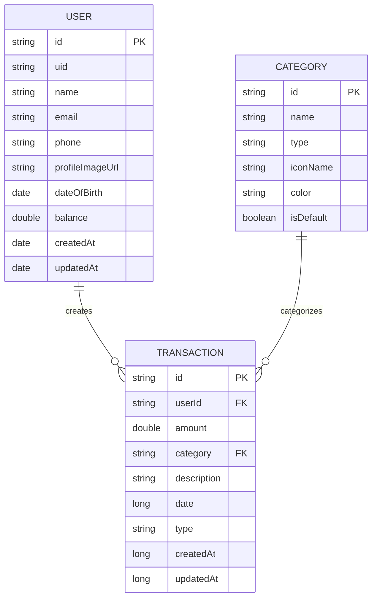

# Sơ đồ Cơ sở dữ liệu Quản lý Tài chính Cá nhân

Dự án sử dụng Firebase Firestore làm cơ sở dữ liệu NoSQL, không sử dụng SQL. Dưới đây là sơ đồ cấu trúc dữ liệu:

## Mô tả các Collection

### 1. Users Collection

- **id**: Định danh duy nhất của người dùng (từ Firebase Authentication)
- **uid**: Định danh người dùng (đồng nhất với id)
- **name**: Tên người dùng
- **email**: Email đăng nhập
- **phone**: Số điện thoại
- **profileImageUrl**: URL ảnh hồ sơ
- **dateOfBirth**: Ngày sinh
- **balance**: Số dư tài khoản
- **createdAt**: Thời điểm tạo tài khoản
- **updatedAt**: Thời điểm cập nhật thông tin

### 2. Categories Collection

- **id**: Định danh duy nhất của danh mục
- **name**: Tên danh mục
- **type**: Loại danh mục ("income" - thu nhập hoặc "expense" - chi tiêu)
- **iconName**: Tên biểu tượng của danh mục
- **color**: Mã màu cho danh mục
- **isDefault**: Cờ đánh dấu danh mục mặc định

### 3. Transactions Collection

- **id**: Định danh duy nhất của giao dịch
- **userId**: ID người dùng thực hiện giao dịch (tham chiếu đến Users)
- **amount**: Số tiền giao dịch
- **category**: Danh mục giao dịch (tham chiếu đến Categories)
- **description**: Mô tả chi tiết giao dịch
- **date**: Thời gian thực hiện giao dịch (timestamp)
- **type**: Loại giao dịch ("income" - thu nhập hoặc "expense" - chi tiêu)
- **createdAt**: Thời điểm tạo giao dịch (timestamp)
- **updatedAt**: Thời điểm cập nhật giao dịch (timestamp)

## Các mối quan hệ

1. Một User có thể có nhiều Transaction (1-n)
2. Một Category có thể được sử dụng trong nhiều Transaction (1-n)

## Lưu ý về Firebase Firestore

Firestore là cơ sở dữ liệu NoSQL, nên không có khái niệm về khóa ngoại (foreign key) như trong cơ sở dữ liệu quan hệ. Thay vào đó, các tham chiếu được thực hiện bằng cách lưu trữ ID của document trong một collection khác.

Việc quản lý tính toàn vẹn dữ liệu phải được thực hiện ở tầng ứng dụng thông qua code Java trong các lớp utility như `DataUtils`, `UserUtils`, `CategoryUtils`, và `TransactionUtils`. 